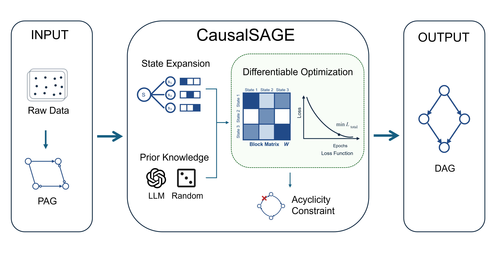

# No More Maybe-Arrows: Resolving Causal Uncertainty by Breaking Symmetries

## CausalSAGE

**CausalSAGE** is a differentiable PAG-to-DAG refinement framework that resolves
orientation ambiguity in Markov equivalence classes and outputs fully directed DAGs.

This repository contains the official implementation used in our experiments.

## Overview

Constraint-based discovery methods such as FCI/RFCI often output partially
directed graphs (PAGs). Many downstream tasks require a fully oriented DAG.

CausalSAGE refines PAG-derived structures through:

- state-level expansion
- directional priors (random or LLM-based)
- differentiable block-wise optimization
- cycle-aware DAG validation/projection

### What makes CausalSAGE different?

Unlike direct DAG learners, CausalSAGE:

- starts from constraint-based PAG outputs
- preserves skeleton structure during refinement
- resolves orientation ambiguity via differentiable optimization
- remains stable on medium-scale graphs where direct learners can degrade
- scales to graphs with 700+ variables given a fixed constraint skeleton

## Method Overview

### Motivation


### Framework



## Key Features

- Differentiable PAG-to-DAG refinement
- Random-prior and LLM-prior runs in one entrypoint
- Unified `config.py` for paths and runtime settings
- Constraint discovery and refinement split into clear modules

## Repository Structure

- `config.py`: central configuration (paths, defaults, dataset settings)
- `assets/figures/`: paper figures for README/docs
- `scripts/`: runnable entrypoints
- `src/refinement/`: differentiable refinement core
- `src/constraints/`: FCI/RFCI/LLM constraint modules
- `data/<dataset>/`: dataset artifacts (`*_data_*.csv`, `metadata*.json`, `*.bif`)
- `outputs/constraints/`: constraint outputs
- `outputs/experiments/`: refinement outputs

## Environment

- Python `>=3.10`

```bash
pip install -r requirements.txt
```

## Quick Start

Run random-prior refinement (paper-aligned style):

```bash
python scripts/run_llm_vs_random.py \
  --datasets alarm \
  --run_mode random \
  --seeds 5 \
  --sample_size 10000 \
  --epochs 140 \
  --high_conf 0.9 \
  --low_conf 0.1 \
  --reconstruction_mode group_ce \
  --vstructure_in_mask \
  --dag_check \
  --dag_project_on_cycle
```

Run LLM-prior refinement:

```bash
python scripts/run_llm_vs_random.py \
  --datasets alarm \
  --run_mode llm \
  --seeds 5 \
  --sample_size 10000 \
  --epochs 140 \
  --high_conf 0.9 \
  --low_conf 0.1 \
  --reconstruction_mode group_ce \
  --vstructure_in_mask \
  --dag_check \
  --dag_project_on_cycle
```

Run both priors:

```bash
python scripts/run_llm_vs_random.py \
  --datasets alarm \
  --run_mode both \
  --seeds 5 \
  --sample_size 10000 \
  --epochs 140 \
  --high_conf 0.9 \
  --low_conf 0.1 \
  --reconstruction_mode group_ce \
  --vstructure_in_mask \
  --dag_check \
  --dag_project_on_cycle
```

## Output Locations

Example experiment outputs:

- `outputs/experiments/llm_vs_random/alarm/n_10000/seed_5/<run_id>/run_report.txt`
- `outputs/experiments/llm_vs_random/alarm/n_10000/seed_5/<run_id>/random_prior/complete_metrics.json`
- `outputs/experiments/llm_vs_random/alarm/n_10000/seed_5/<run_id>/llm_prior/complete_metrics.json`
- `outputs/experiments/llm_vs_random/alarm/n_10000/seed_5/<run_id>/comparison_report.txt`

Constraint outputs:

- `outputs/constraints/<dataset>/n_<sample_size>/`

## Expected Result Pattern (alarm)

For paper-aligned random-prior runs (`seed=5`, `n=10000`, `epochs=140`):

- Edge F1 approximately `0.88`
- Full SHD approximately `8`

Small floating-point differences are acceptable.

## Reproducibility

Results are reproducible given:

- identical dataset and metadata
- identical constraint files
- fixed random seed
- same dependency versions

## Citation

If you find this work useful, please cite:

```bibtex
@misc{huang2026causalsage,
  title={No More Maybe-Arrows: Resolving Causal Uncertainty by Breaking Symmetries},
  author={Huang, Tingrui and Dhami, Devendra Singh},
  year={2026}
}
```
